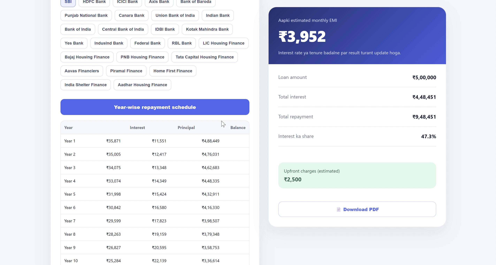
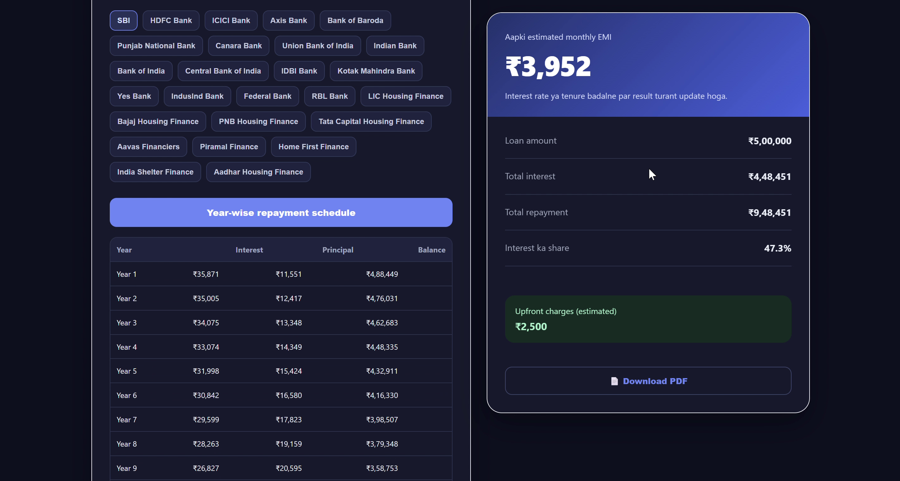
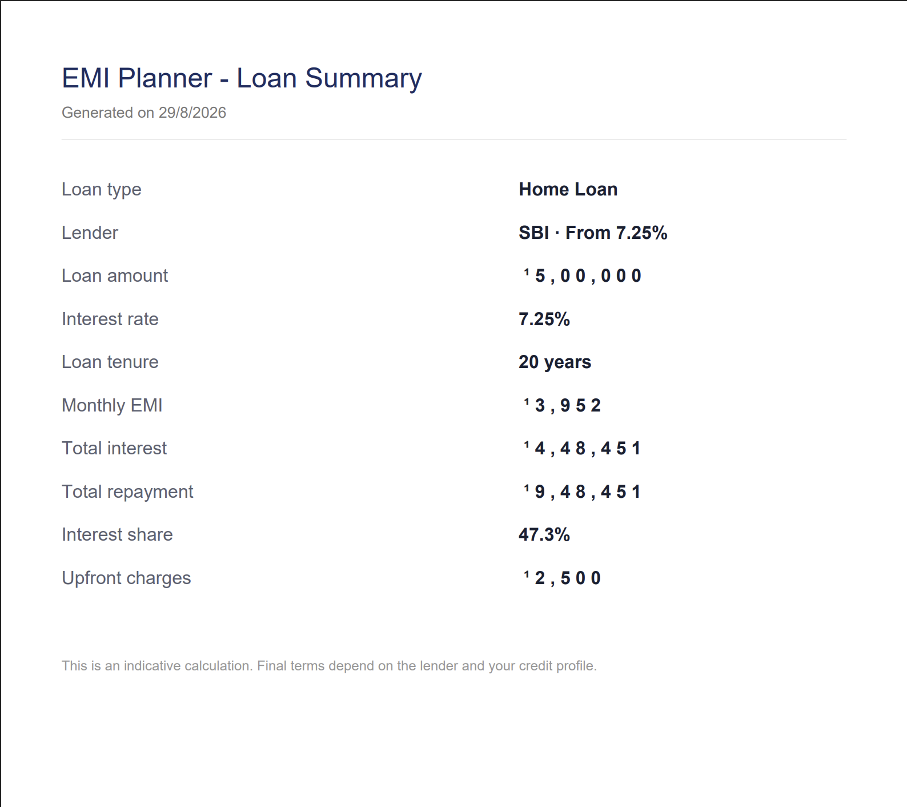

# 💰 ABRAR EMI Calculator

A fast, private, and fully client-side **loan EMI calculator** — plan home, personal, car, and business loans with live bank rate comparisons, amortization schedules, prepayment analysis, and PDF export. No signup, no data collection, everything runs in your browser.

**🔗 Live Demo:** [shaikhabrar12557-lang.github.io/ABRAR-EMI-CALCULATOR](https://shaikhabrar12557-lang.github.io/ABRAR-EMI-CALCULATOR/)

---

## ✨ Features

- 📊 **Instant EMI calculation** — monthly EMI, total interest, and total repayment update live as you type or drag sliders
- 🏦 **Multi-bank/NBFC comparison** — indicative starting rates from 20+ banks and finance companies across Home, Personal, Car, and Business loans
- 📅 **Year-wise amortization schedule** — see exactly how much interest vs principal you pay each year
- 💸 **Prepayment impact calculator** — check how much interest a lump-sum prepayment could save you
- 🌙 **Dark mode** — toggle between light and dark themes, saved automatically for your next visit
- 📄 **PDF export** — download a clean summary of your loan calculation as a PDF
- 🔒 **100% private** — all calculations happen in your browser; nothing is ever sent to a server or saved

---

## 📸 Screenshots

### Light Mode


### Dark Mode


### PDF Export


---

## 🛠️ Built With

- HTML5, CSS3, Vanilla JavaScript — no frameworks, no build step
- [jsPDF](https://github.com/parallax/jsPDF) for PDF generation
- Deployed via GitHub Pages

---

## 🚀 Getting Started

Just open the [live site](https://shaikhabrar12557-lang.github.io/ABRAR-EMI-CALCULATOR/) — no installation needed.

To run locally:
```bash
git clone https://github.com/shaikhabrar12557-lang/ABRAR-EMI-CALCULATOR.git
cd ABRAR-EMI-CALCULATOR
# Open index.html in your browser
```

---

## 📌 Disclaimer

This is an indicative calculation tool. Final interest rates, fees, and EMI depend on the lender, your credit profile, and final loan terms.

---

## ⭐ Support

If you found this useful, consider giving it a star — it helps others discover the project!

